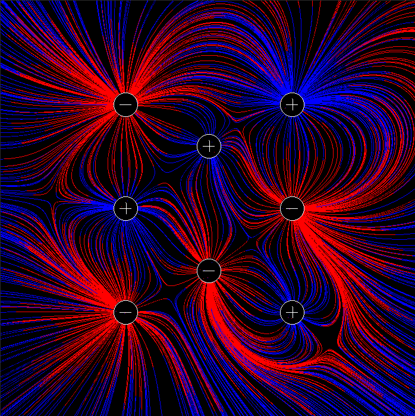

# Simple Electric Field Simulation
**Authors**: Nikola Antonijevic & Damian Boquete Costa
**Last modification**: 29.05.2021

---

<p align="center">
  
</p>

### Description
This project is a simple electric field simulator implemented in the C language. It simulates the interaction between positively and negatively charged particles.

### How to Run (Linux)
To execute the program, follow these steps:

1. Execute the Makefile to create the executable:
   ```shell
   make
   ```

2. Run the `ef_sim` file:
   ```shell
   ./ef_sim
   ```
